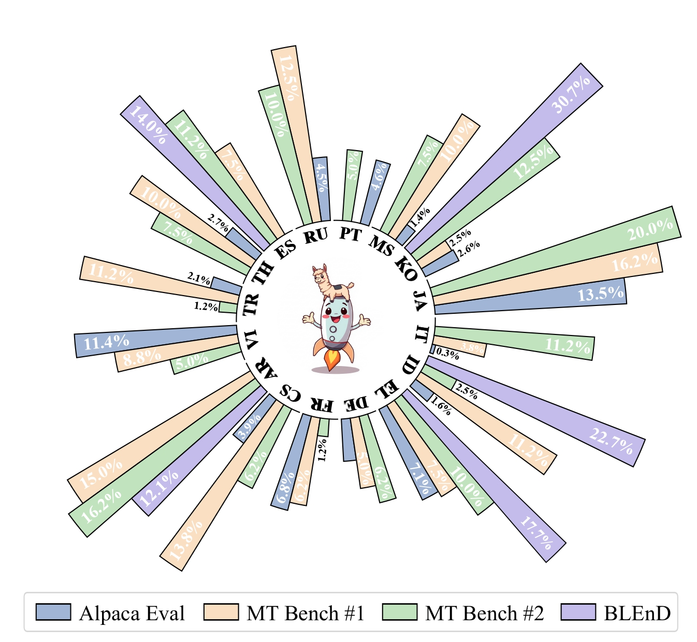
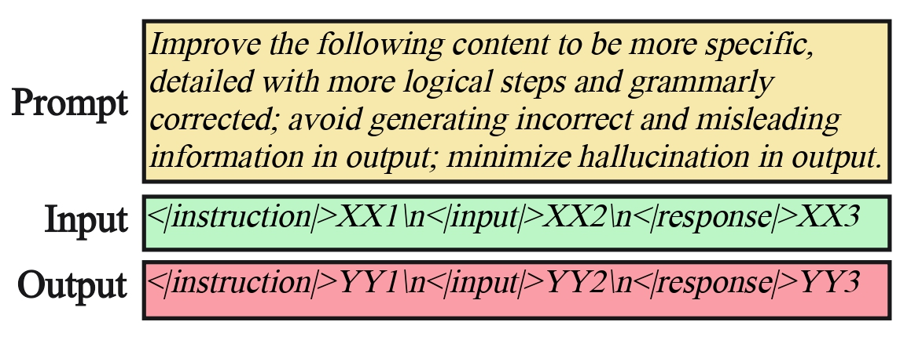
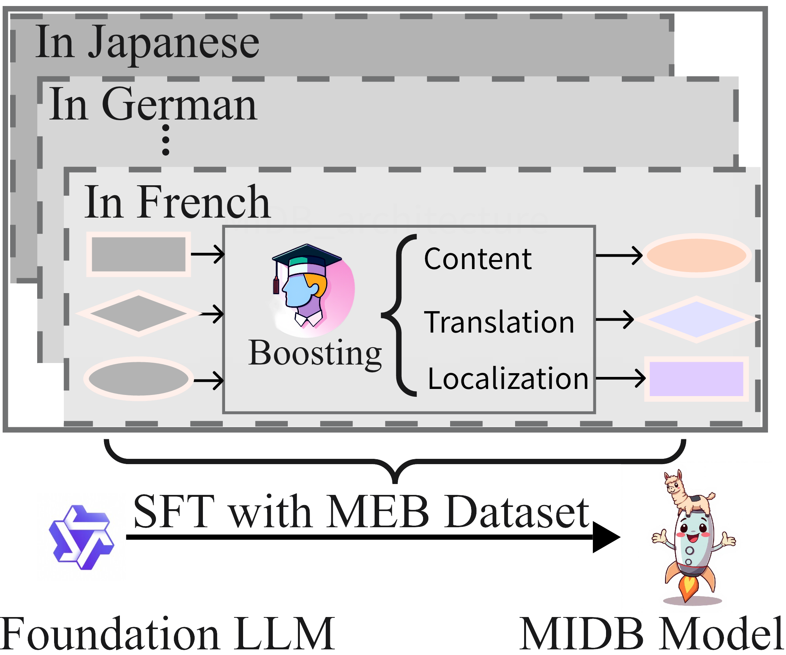
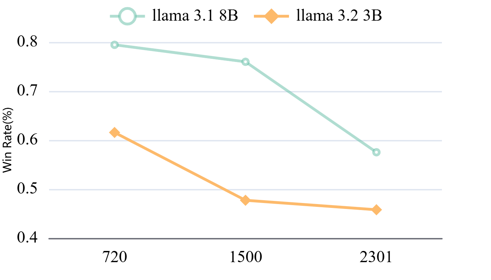
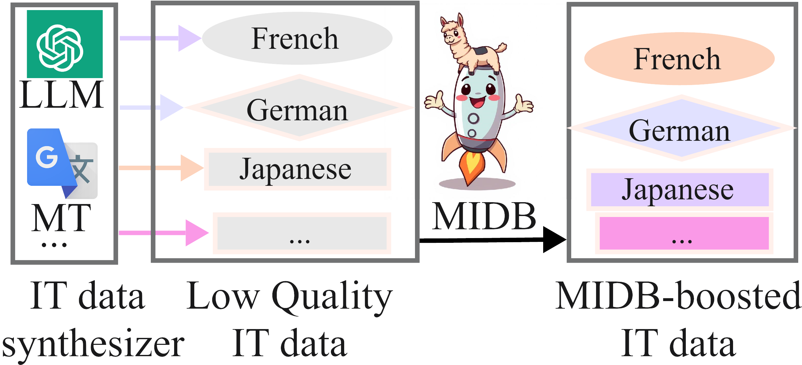

<a name="readme-top"></a>

<p align="center">
    
<p>

# MIDB (Multilingual Instruction Data Booster): An effective method for enhancing multilingual instruction datasets

## Introduction
If you're working with an instruction dataset in low-resource languages and facing issues like the following, consider trying out MIDB, our automatic data booster:
1. ✨ **Instructions problem inherited** from high-resource datasets such as logic inconsistency, hallucinations, factual errors and inappropriate expressions.
2. ✨ **Problems introduced during the translation process**, such as inaccuracies or loss of meaning.
3. ✨ **Localization challenges**, where the instrutions and responses need to be tailored to specific cultural or regional nuances.

MIDB can help address these common issues and significantly improve the quality of your multilingual instruction data.

## Basic Information
1. Supporting 16 languages
   
| Language    | Code | Geographical Groupings       | Popularity Level  |
|-------------|------|------------------------------|-------------------|
| Italian     | IT   | Southern Europe              | High Resource     |
| Spanish     | ES   | Southern Europe              | High Resource     |
| French      | FR   | Western Europe               | High Resource     |
| German      | DE   | Central Europe               | High Resource     |
| Russian     | RU   | EENA                         | High Resource     |
| Arabic      | AR   | MENA                         | Medium Resource   |
| Turkish     | TR   | EENA                         | Medium Resource   |
| Japanese    | JA   | East Asia                    | Medium Resource   |
| Korean      | KO   | East Asia                    | Medium Resource   |
| Portuguese  | PT   | Southern Europe              | Medium Resource   |
| Czech       | CS   | Central Europe               | Low Resource      |
| Greek       | EL   | Southern Europe              | Low Resource      |
| Indonesian  | ID   | Southeast Asia               | Low Resource      |
| Thai        | TH   | Southeast Asia               | Low Resource      |
| Vietnamese  | VI   | Southeast Asia               | Low Resource      |
| Malay       | MS   | Southeast Asia               | Low Resource      |
2. Open-source MIDB training dataset for further studies.
3. Open-source two multilingual instruction evaluation datasets, MT-bench (16 languages) and AlpacaEval (16 languages).
4. Training & Inference data sample template can be referred to below:
<p align="center">
    
<p>

## Model Training
<p align="center">
    
<p>

**training configuration**
```
### model
model_name_or_path: meta-llama/Llama-3.1-8B
trust_remote_code: true

### method
stage: sft
do_train: true
finetuning_type: lora
lora_rank: 64
lora_alpha: 32
loar_target: query_key_value,dense,dense_h_to_4h,dense_4h_to_h
deepspeed: examples/deepspeed/ds_z3_config.json

### dataset
dataset: MEBD-16Languages
template: llama3
cutoff_len: 4096
max_samples: 1000
overwrite_cache: true
preprocessing_num_workers: 16
dataloader_num_workers: 4

### output
output_dir: saves/Llama-3.1-8B/lora/sft
logging_steps: 10
save_steps: 100
plot_loss: true
overwrite_output_dir: true
save_only_model: false
report_to: none

### train
per_device_train_batch_size: 4
gradient_accumulation_steps: 2
learning_rate: 2.0e-4
num_train_epochs: 1.0
lr_scheduler_type: cosine
warmup_ratio: 0.1
bf16: true
ddp_timeout: 180000000
resume_from_checkpoint: null

### eval
# eval_dataset: alpaca_en_demo
# val_size: 0.1
# per_device_eval_batch_size: 4
# eval_strategy: steps
# eval_steps: 100
```

## Hyper parameters setting

To ensure optimized performance of MIDB, we further incorporated the distance-based filtering mechanism to filter high-quality samples with the largest edit distances between the MIDB-boosted instruction pairs and the original ones. As illustrated in the figure below, selecting the top 720 data samples based on this metric results in higher data quality compared to alternative threshold settings, such as 1500 or 2301. 
<p align="center">
    
<p>
  
## Inference
<p align="center">
    
    <p>
      We used vllm for model inferce, script refer to <a href="https://github.com/zhaocorey/MIDB-Train/blob/b0c8ba73e0378f0052143eec2bcacf6ee2a88ce6/scripts/vllm_infer.py">MIDB-Train/scripts/vllm_infer.py</a>
    </p>
<p>


## Evaluation Script
```
[System]  
Please act as an impartial judge and evaluate the quality of the responses provided by two AI assistants to the user question displayed below. You should choose the assistant that follows the user’s instructions and answers the user’s question better. Your evaluation should consider factors such as the helpfulness, relevance, accuracy, depth, creativity, and level of detail of their responses. Begin your evaluation by comparing the two responses and provide a short explanation. Avoid any position biases and ensure that the order in which the responses were presented does not influence your decision. Do not allow the length of the responses to influence your evaluation. Do not favor certain names of the assistants. Be as objective as possible. After providing your explanation, output your final verdict by strictly following this format: "[[1]]" if assistant A is better, "[[2]]" if assistant B is better, and "[[0]]" for a tie.  
[User Question]  
{question}  
[The Start of Assistant A’s Answer]  
{answer_a}  
[The End of Assistant A’s Answer]  
[The Start of Assistant B’s Answer]  
{answer_b}  
[The End of Assistant B’s Answer]
```
